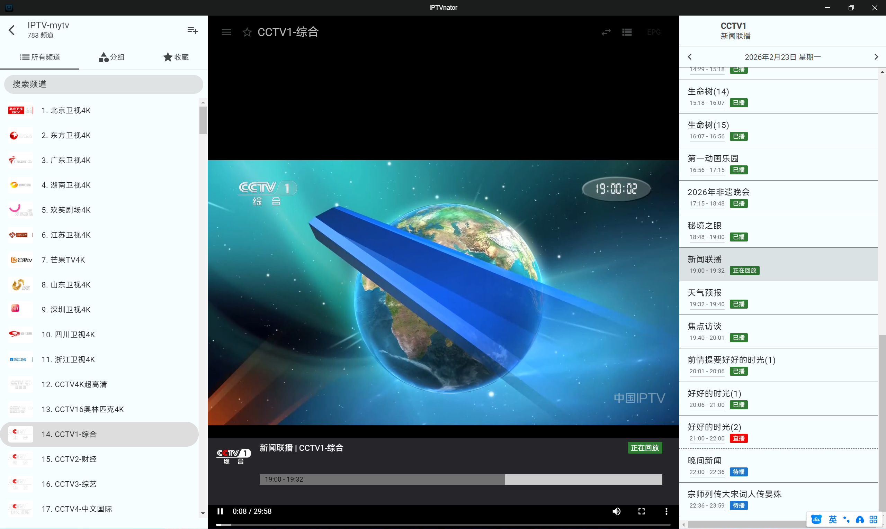

# IPTVnator - IPTV 播放器应用

**IPTVnator** 是一款跨平台、开源的 IPTV 播放器，支持播放和管理 m3u/m3u8 播放列表。你可以通过远程 URL 或本地文件导入播放列表；同时支持基于 XMLTV 的节目单（EPG）。

应用基于 Electron 和 Angular 开发，支持 Windows、macOS 与 Linux。

⚠️ 说明：IPTVnator 不提供任何播放列表或数字内容。截图中的频道与图片仅用于演示。



## 功能特性

- 支持 m3u 与 m3u8 播放列表 📺
- 支持 Xtream Code (XC) 与 Stalker portal (STB)
- 支持外部播放器（mpv、VLC）
- 从本地文件或远程 URL 添加播放列表 📂
- 应用启动时自动更新播放列表
- 频道搜索 🔍
- 支持 EPG（电视节目单），展示详细信息
- 电视存档/时移/回看
- 按分组显示频道
- 收藏频道并统一管理
- 支持 HTML 播放器（hls.js）或基于 Video.js 的播放器
- 内置多语言（目前支持 en, ru, de, ko, es, zh, fr, it）
- 可为播放列表设置自定义 User-Agent
- 明暗主题切换
- 提供可自托管的 Docker 版本

## 下载

- 前往 [Releases 页面](https://github.com/4gray/iptvnator/releases) 获取适用于 macOS、Windows、Linux 的最新安装包。
- Snap 包：

```
$ sudo snap install iptvnator
```

- Arch Linux（AUR）：[iptvnator-bin](https://aur.archlinux.org/packages/iptvnator-bin/)

```
$ yay -S iptvnator-bin
```

[](https://snapcraft.io/iptvnator)

## 自托管（Docker）

如果你想在本地以 PWA 方式运行，可参考 [docker/README.md](./docker/README.md) 获取前后端启动与构建说明。

## 本地构建

前置条件：已安装 Node.js 与 npm。

1. 安装依赖：

```
$ npm install
```

2. 构建桌面应用：

```
# Linux
$ npm run electron:build:linux

# macOS
$ npm run electron:build:mac

# Windows
$ npm run electron:build:windows
```

构建产物将输出到 `release` 目录；打包配置位于 `electron-builder.json` 与 `package.json`。如需跨平台构建的注意事项，请参考 [electron-builder 文档](https://www.electron.build/)。

> 注：不要期望在单一平台为所有平台构建应用，详情见上游文档的多平台构建说明。

## 开发调试

安装依赖后运行：

```
$ npm run start
```

Electron 版本会以独立窗口打开；PWA 版本可在浏览器访问 http://localhost:4200。

仅运行 Angular 前端：

```
$ npm run ng:serve
```

## 免责声明

IPTVnator 不提供任何播放列表或其他数字内容。

## 项目来源

本仓库来源于 GitHub 上的开源项目 [4gray/iptvnator](https://github.com/4gray/iptvnator)。项目由上游社区发起并维护，采用 MIT 许可证。在此感谢上游作者与所有贡献者。

许可证见 [LICENSE.md](./LICENSE.md)。

